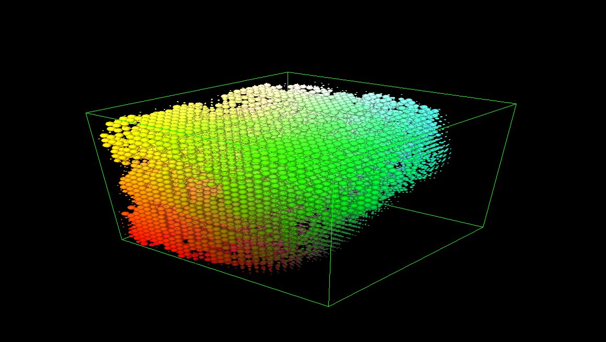

# cellurar3d

## Cellular3d is a simple university project for cellular automata visualization. It's written in C++ with use of OpenGL and SFML libraries. Similarity to 2D game of life can be found.

### Concepts:

```
- Cells states are either dead or live
- Cells interact with other cells that stay in close neighbourhood
- Cells are aged - 1 is newborn cell (smaller sphere) and 10 is mature cell (full size sphere)
- Neighbourhood type is either von Neumann or Moore
- Rules are defined in code, which can be changed at runtime
- Rules define born and survive conditions
```




### Controls:
```
- Scroll mouse wheel to zoom in/out
- Press LMB and drag to move around cells encapsulated in box
- Type `L` to enable/disable light
- Type `S` to spawn some cells at random places
- Type `D` to kill some cells at random places
- Type `N` to change neighbourhood rule
- Type `Delete` button to kill all cells, then you can start from beginning

- Press and hold + (Add button) with:
    - Numpad1 or Num1 to increase lower born condition
    - Numpad2 or Num2 to increase upper born condition
    - Numpad4 or Num4 to increase lower survive condition
    - Numpad5 or Num5 to increase upper survive condition

- Press and hold - (Subtract button) with:
    - Numpad1 or Num1 to decrease lower born condition
    - Numpad2 or Num2 to decrease upper born condition
    - Numpad4 or Num4 to decrease lower survive condition
    - Numpad5 or Num5 to decrease upper survive condition    

```

### Compilation
```

To compile code you can use included CMakeLists file.
Init cmake environment in build folder and start compilation.
You will need additional libraries:
- OpenGL
- SFML

```